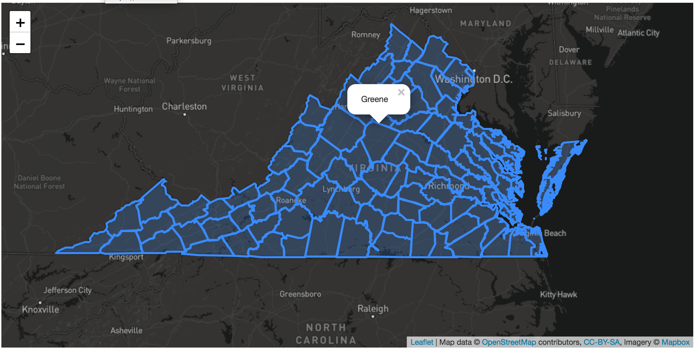

# Fulcrum Map Package

This is a base example of a leaflet map with historical VA county boundaries projected on the map layers.

All dependencies (CSS, JS) are loaded in the body of the `index.html` and that file can be opened in a browser directly by file path or served on a local server.

If you click on a county, a popup with the county name should be displayed.

The result should look something like this:
